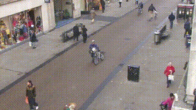
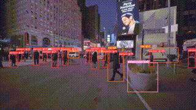
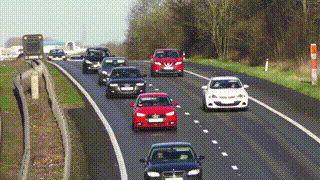

# <div align="center">Simple Object Tracking</div>

<div align="center">
<p>Multi-Object Tracking with YOLOv5, CLIP, DINO and DeepSORT</p>
<p>
   
</p>
</div>

## Introduction

This is a simple two-stage mulit-object tracking [YOLOv5](https://github.com/ultralytics/yolov5) and [DeepSORT](https://arxiv.org/abs/1703.07402) with zero-short or self-supervised feature extractors. 

Normally, in DeepSORT, the deep part of the model is trained on a person re-identification dataset like [Market1501](https://www.kaggle.com/pengcw1/market-1501/data). We will replace this model with zero-shot or self-supervised models; which makes it ready to track any classes without needing to re-train.

SOTA models like [CLIP](https://arxiv.org/abs/2103.00020) (zero-shot) and [DINO](https://arxiv.org/abs/2104.14294v2) (SSL) are currently experimented. If better models come out, I will consider adding it. 

## Requirements

* torch >= 1.8.1
* torchvision >= 0.9.1

Other requirements can be installed with `pip install -r requirements.txt`.

Clone the repository recursively:

```bash
$ git clone --recursive https://github.com/sithu31296/simple-object-tracking.git
```

Then download a YOLO model's weight from [YOLOv5](https://github.com/ultralytics/yolov5) and place it in `checkpoints`.

## Tracking

Track all classes:

```bash
## webcam
$ python track.py --source 0 --yolo-model checkpoints/yolov5s.pt --reid-model CLIP-RN50

## video
$ python track.py --source VIDEO_PATH --yolo-model checkpoints/yolov5s.pt --reid-model CLIP-RN50
```

Track only specified classes:

```bash
## track only person class
$ python track.py --source 0 --yolo-model checkpoints/yolov5s.pt --reid-model CLIP-RN50 --filter-class 0

## track person and car classes
$ python track.py --source 0 --yolo-model checkpoints/yolov5s.pt --reid-model CLIP-RN50 --filter-class 0 2
```

Available ReID models (Feature Extractors):
* **CLIP**: `CLIP-RN50`, `CLIP-ViT-B/32`
* **DINO**: `DINO-XciT-S12/16`, `DINO-XciT-M24/16`, `DINO-ViT-S/16`, `DINO-ViT-B/16`

Check [here](tracking/utils.py#L14) to get COCO class index for your class.

## Evaluate on MOT16

* Download MOT16 dataset from [here](https://motchallenge.net/data/MOT16.zip) and unzip it.
* Download mot-challenge ground-truth [data](https://omnomnom.vision.rwth-aachen.de/data/TrackEval/data.zip) for evaluating with TrackEval. Then, unzip it under the project directory.
* Save the tracking results of MOT16 with the following command:

```bash
$ python eval_mot.py --root MOT16_ROOT_DIR --yolo-model checkpoints/yolov5m.pt --reid-model CLIP-RN50
```

* Evaluate with TrackEval:

```bash
$ python TrackEval/scripts/run_mot_challenge.py \
    --BENCHMARK MOT16 \
    --GT_FOLDER PROJECT_ROOT/data/gt/mot_challenge/ \
    --TRACKERS_FOLDER PROJECT_ROOT/data/trackers/mot_challenge/ \
    --TRACKERS_TO_EVAL mot_det \
    --SPLIT_TO_EVAL train \
    --USE_PARALLEL True \
    --NUM_PARALLEL_CORES 4 \
    --PRINT_ONLY_COMBINED True \
```

> Notes: `FOLDER` parameters in `run_mot_challenge.py` must be an absolute path.

For tracking persons, instead of using a COCO-pretrained model, using a model trained on multi-person dataset will get better accuracy. You can download a YOLOv5m model trained on [CrowdHuman](https://www.crowdhuman.org/) dataset from [here](https://drive.google.com/file/d/1gglIwqxaH2iTvy6lZlXuAcMpd_U0GCUb/view?usp=sharing). The weights are from [deepakcrk/yolov5-crowdhuman](https://github.com/deepakcrk/yolov5-crowdhuman). It has 2 classes: 'person' and 'head'. So, you can use this model for both person and head tracking.

## Results

**MOT16 Evaluation Results**

Detector | Feature Extractor | MOTA↑ | HOTA↑ | IDF1↑ | IDsw↓ | MT↑ | ML↓ | FP↓ | FN↓ | FPS<br><sup>(GTX1660ti)
--- | --- | --- | --- | --- | --- | --- | --- | --- | --- | ---
YOLOv5m<sup><br>(COCO) | CLIP<sup><br>(RN50) | 35.42 | 35.37 | 39.42 | **486** | 115 | 192 | **6880** | 63931 | 7
YOLOv5m<sup><br>(CrowdHuman) | CLIP<sup><br>(RN50) | 53.25 | 43.25 | 52.12 | 912 | 196 | **89** | 14076 | 36625 | 6
YOLOv5m<sup><br>(CrowdHuman) | CLIP<sup><br>(ViT-B/32) | 53.35 | 43.03 | 51.25 | 896 | **199** | 91 | 14035 | **36575** | 4
||
YOLOv5m<sup><br>(CrowdHuman) | DINO<sup><br>(XciT-S12/16) | 54.41 | 47.44 | 59.01 | 511 | 184 | 101 | 12265 | 37555 |8
YOLOv5m<sup><br>(CrowdHuman) | DINO<sup><br>(ViT-S/16) | 54.56 | 47.61 | 58.94 | 519 | 189 | 97 | 12346 | 37308 | 8
YOLOv5m<sup><br>(CrowdHuman) | DINO<sup><br>(XciT-M24/16) | 54.56 | **47.71** | **59.77** | 504 | 187 | 96 | 12364 | 37306 | 5
YOLOv5m<sup><br>(CrowdHuman) | DINO<sup><br>(ViT-B/16) | **54.58** | 47.55 | 58.89 | 507 | 184 | 97 | 12017 | 37621 | 5

**FPS Results**

Detector | Feature Extractor | GPU | Precision | Image Size | Detection<br>/Frame | FPS
--- | --- | --- | --- | --- | --- | ---
YOLOv5s | CLIP-RN50 | GTX-1660ti | FP32 | 480x640 | 1 | 38
YOLOv5s | CLIP-ViT-B/32 | GTX-1660ti | FP32 | 480x640 | 1 | 30
||
YOLOv5s | DINO-XciT-S12/16 | GTX-1660ti | FP32 | 480x640 | 1 | 36
YOLOv5s | DINO-ViT-B/16 | GTX-1660ti | FP32 | 480x640 | 1 | 30
YOLOv5s | DINO-XciT-M24/16 | GTX-1660ti | FP32 | 480x640 | 1 | 25


## References

* https://github.com/ultralytics/yolov5
* https://github.com/JonathonLuiten/TrackEval

## Citations

```
@inproceedings{caron2021emerging,
  title={Emerging Properties in Self-Supervised Vision Transformers},
  author={Caron, Mathilde and Touvron, Hugo and Misra, Ishan and J\'egou, Herv\'e  and Mairal, Julien and Bojanowski, Piotr and Joulin, Armand},
  booktitle={Proceedings of the International Conference on Computer Vision (ICCV)},
  year={2021}
}

@article{el2021xcit,
  title={XCiT: Cross-Covariance Image Transformers},
  author={El-Nouby, Alaaeldin and Touvron, Hugo and Caron, Mathilde and Bojanowski, Piotr and Douze, Matthijs and Joulin, Armand and Laptev, Ivan and Neverova, Natalia and Synnaeve, Gabriel and Verbeek, Jakob and others},
  journal={arXiv preprint arXiv:2106.09681},
  year={2021}
}

@misc{radford2021learning,
  title={Learning Transferable Visual Models From Natural Language Supervision}, 
  author={Alec Radford and Jong Wook Kim and Chris Hallacy and Aditya Ramesh and Gabriel Goh and Sandhini Agarwal and Girish Sastry and Amanda Askell and Pamela Mishkin and Jack Clark and Gretchen Krueger and Ilya Sutskever},
  year={2021},
  eprint={2103.00020},
  archivePrefix={arXiv},
  primaryClass={cs.CV}
}

@inproceedings{Wojke2017simple,
  title={Simple Online and Realtime Tracking with a Deep Association Metric},
  author={Wojke, Nicolai and Bewley, Alex and Paulus, Dietrich},
  booktitle={2017 IEEE International Conference on Image Processing (ICIP)},
  year={2017},
  pages={3645--3649},
  organization={IEEE},
  doi={10.1109/ICIP.2017.8296962}
}

@inproceedings{Wojke2018deep,
  title={Deep Cosine Metric Learning for Person Re-identification},
  author={Wojke, Nicolai and Bewley, Alex},
  booktitle={2018 IEEE Winter Conference on Applications of Computer Vision (WACV)},
  year={2018},
  pages={748--756},
  organization={IEEE},
  doi={10.1109/WACV.2018.00087}
}
```